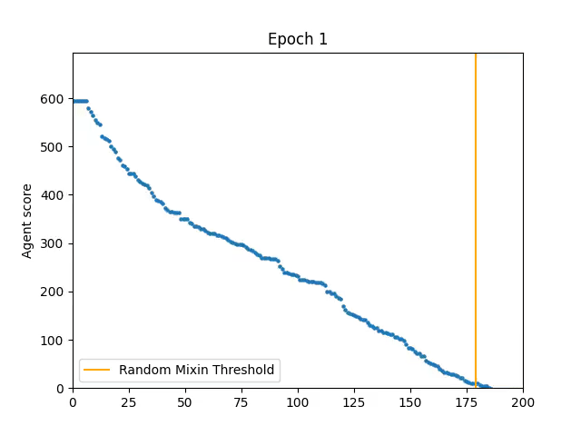
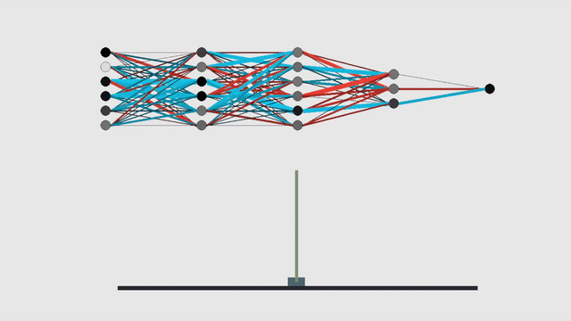

# Evolutionary Mace Balancing
Train AI agents to perform mace balancing using an evolutionary neural network.

## Background

"Mace balancing" involves applying some (limited) force to a base that is supporting a pole, such that the pole does not fall over, with the added challenge of a heavy chain hanging off the end of the pole. This chain massively increases the chaos of the system and makes the balancing act a much harder problem than simple pole balancing.

#### Evolution
We employ a mutation-and-selection evolutionary algorithm to create highly capable mace balancing agents. An agent’s relative fitness is represented by a score defined as the number of frames the pole is balanced above the base subtracted by the total horizontal distance the base traveled.  This slight penalty for motion should favor stable solutions requiring less simulated effort. The agents with the highest scores are selected to reproduce and populate successive generations. 

Each generation, gaussian noise with a certain standard deviation is applied to all the weights in the top networks. The number of networks chosen for reproduction is specified with the -r command line argument. In our experimentation, roughly 10-20% of the total number of agents seems to work best.

#### Agent Movement
The agents make decisions frame-by-frame about how much "effort" to apply to move their base and in what direction. This "effort" value is unbounded, but is passed through a tanh function and scaled according to their "strength" property, to mimic the way that a living being applies force in the real world.

Noise is applied to the physics of the mace, as well as the force output of the network, to add additional challenge and realism. This also prevents overfitting in the model; it cannot simply learn to account for an exact starting condition as every run will be slightly different.

The decision process is executed with a custom coded neural network based in NumPy. The Physics system was created using Thomas Jakobsen’s [Advanced Character Physics](http://www.cs.cmu.edu/afs/cs/academic/class/15462-s13/www/lec_slides/Jakobsen.pdf). All graphics and window management is implemented using the Pygame library

## Training
During training we use "early stopping" to improve efficiency. If 20 agents are reproducing each round, then there is no need to simulate further once only 20 agents remain.

Initially when experimenting, we found that it wasn’t very hard to get a network that would become stable and keep the mace balanced indefinitely, but when loading that same network up again, it would usually fail. This is because handling the initial chaos of the chain dropping is a much harder task than keeping the pole balanced once the chain is hanging mostly still. Thus, one or two networks would get lucky in the opening, and survive afterward. Because of this, it was necessary not to just get one or two networks to become stable, but to train such that all networks in a new generation (at least, all networks descended from the previous generation) were stable.

Stability was defined with a constant called `SUCCESS_THRESHOLD`, which is defined in `src/constants.py`.

We also implemented mutation decay: very similar to learning rate decay in gradient descent, we multiply the standard deviation of the gaussian noise applied to the weights by a constant called `MUTATION_DECAY` also defined in `src/constants.py`. This prevents overshooting once a more refined network has been achieved.

To prevent getting stuck in local minima, we also reserve a certain portion of each generation for brand-new randomly initialized agents. We call this portion `RANDOM_MIXIN` in `src/constants.py`.

Training to get all the networks to consistently be stable takes a very long time, because the better the nets get, the longer the simulation takes. To help mitigate this, we stop agents once they reach a score of `SUCCESS_THRESHOLD`, which in our experiments worked best around 5000. It is entirely possible to have nets that go past 5000 score and still eventually fall, but it is uncommon and having a cap there instead of, say, 50,000 drastically improves training time, so more epochs can be applied.

Here's what training looks like. This is with 100 agents per round, the 20 best of which reproduce. The success threshold was set to 5000. Early stopping is turned off partway through to help illustrate the early performance of these agents, but this wouldn't be done in a real training session (in fact, graphics wouldn’t be on at all).

## Example Results

The following shows training for 200 epochs with 200 agents, 10% random mixins, and 10 agents selected for reproduction each epoch.

As you can see, by epoch 200 (but not earlier!) all 180 agents that are not random mixins reach 5000 score, indicating success.

Here's how the best network from the above training session performs:

## Usage
| Argument     | Type  |Description |
|--------------|-------|------------|
|-h, --help    |  n/a  |  Shows the help message |
|-a, -agents    |  integer | The number of agents to simulate |
|-r, --reproducers | integer | The number of agents that reproduce after each round|
|-e, --epochs| integer | The number of epochs to train the agents for |
|-c, --chainlength | integer | The number of additional segments to add onto the ends of the rods |
|-n, --nographics | n/a | Disable graphics which allows for much faster training |
|-l, --loadname | String | Filepath to a network file to load. Will not train the loaded network |
|-s, --savename | String | Filepath to the file the best network will be saved in |
